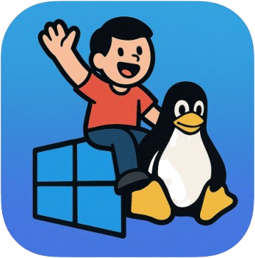

# ClusterJockey

> [!WARNING]
> **This project has been abandoned.** It was a failed attempt at automating VM provisioning for cluster emulation on a Windows desktop via unattended Ubuntu and Windows VM creation. The approach didn't pan out, and the broader goal (running Helm/Kubernetes workloads side-by-side on Windows) is now solved by [Crosspose](https://github.com/andrewiankidd/crosspose). This repo is left in place for posterity but no further changes will be made here.

## About

ClusterJockey was a Windows desktop tool (WinForms / C#) intended to automate the provisioning of Ubuntu and Windows VMs for local Kubernetes cluster emulation. The idea was to give a single-machine "click-to-spin-up-a-cluster" experience without leaving Windows or wrestling with hand-rolled VM setup.

See [Crosspose](https://github.com/andrewiankidd/crosspose) for the spiritual successor that took a different (and ultimately working) approach to the underlying problem.
